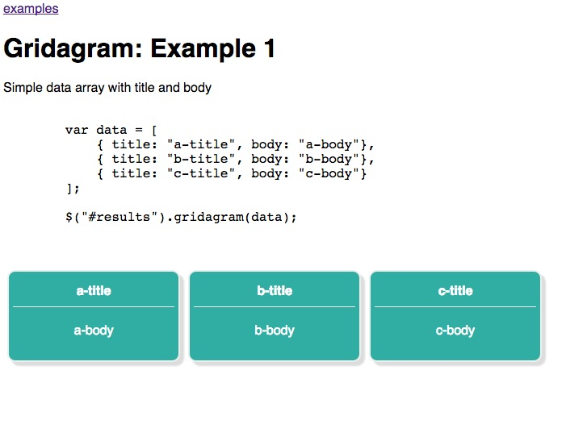

# Gridagram

Dynamic grid layout for on screen data, like a poor man's [gridster](http://dsmorse.github.io/gridster.js/) or an even poorer man's [dashing](http://dashing.io/).

# Installation

Download jQuery, or get it from the ``vendor`` directory.  
Copy the contents of the ``lib`` directory
Include all files in your HTML

Check out the examples for more detail

# Use

Gridagram requires only jQuery, a target element to put the output into, and an array of data
elements to work on:

    

    var data = [ some elements ];

    var grid = $("#somediv").gridagram( data, [options] );

# Options

**width**: width of widgets in pixels, default 200  
**height**: height of widgets in pixels, default 100  
**titleField**: field in each object to use as a title, default "title"  
**bodyField**: field in each object to use as a body, default "body"  
**widgetId**: field in each object to use as an id, no default  
**orderBy**: sort function to order the array of objects, default is not to sort  
